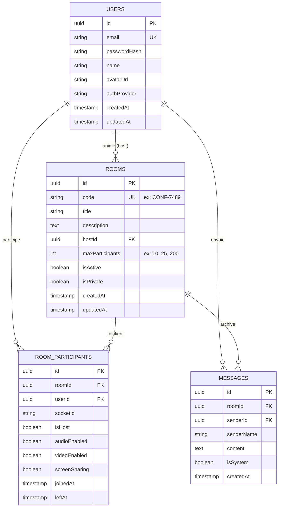

# ConfeRoom - Plateforme de Visioconférence Haute Capacité

Application web de visioconférence temps réel conçue pour la haute concurrence avec contrôle strict et atomique de la capacité des salles.

---

## 1. Diagramme d’Architecture Globale

```mermaid
flowchart TB
    subgraph Clients["Navigateurs Web (Desktop / Mobile)"]
        Client1["Client A (React 18 + WebRTC)"]
        Client2["Client B (React 18 + WebRTC)"]
        ClientN["Client N (Tentative d'accès)"]
    end

    subgraph Edge["Reverse Proxy / Ingress"]
        Nginx["Nginx (Port 80 / 3000)"]
    end

    subgraph BackendCluster["Cluster Applicatif"]
        NestApp["NestJS Backend (Port 3001)\n- REST API (Auth, Rooms)\n- Socket.io Signaling Gateway"]
        
        subgraph MediaServer["SFU WebRTC"]
            LiveKit["LiveKit Server (Port 7880)\n- SFU Média (Audio/Vidéo/Écran)\n- Dynacast & Simulcast"]
        end
    end

    subgraph Storage["Persistance & Cache Temps Réel"]
        Redis[("Redis 7 (Port 6379)\n- Verrous atomiques (Script Lua)\n- Présence & Jetons de capacité\n- O(1) Check & SADD")]
        Postgres[("PostgreSQL 16 (Port 5432)\n- Utilisateurs (JWT/Bcrypt)\n- Salles & Configurations\n- Historique des participations\n- Messages de chat")]
    end

    Client1 -->|HTTP & WS| Nginx
    Client2 -->|HTTP & WS| Nginx
    ClientN -->|HTTP & WS| Nginx

    Nginx -->|/api & /socket.io| NestApp
    Client1 <==>|Flux Média WebRTC SRTP/UDP| LiveKit
    Client2 <==>|Flux Média WebRTC SRTP/UDP| LiveKit

    NestApp -->|EVALSHA (Script Lua Atomique)| Redis
    NestApp -->|TypeORM ORM Queries| Postgres
    NestApp -->|Génération AccessToken JWT| LiveKit
```

---

## 2. Schéma de Base de Données (PostgreSQL)



---

## 3. Logique de Contrôle Atomique de Capacité (Redis Lua)

### Le Problème de Concurrence (Race Condition TOCTOU)
Lors d'une réunion populaire (webinar, all-hands), des dizaines d'utilisateurs cliquent sur « Rejoindre » à la même milliseconde. Une approche classique en 2 étapes (`SELECT COUNT(*)` puis `INSERT`) provoque une **surréservation (overbooking)** systématique car plusieurs requêtes lisent la même valeur avant qu'une écriture ne soit validée.

### La Solution : Script Lua Redis
Redis exécute les scripts Lua de façon strictement mono-threadée et atomique. Aucune autre opération ne peut s'intercaler pendant l'évaluation.

```lua
-- KEYS[1] : 'room:<roomId>:participants' (Redis Set)
-- ARGV[1] : userId
-- ARGV[2] : maxCapacity
-- ARGV[3] : socketId

local key_participants = KEYS[1]
local user_id = ARGV[1]
local max_capacity = tonumber(ARGV[2])

-- 1. Idempotence : Si l'utilisateur est déjà dans la salle (reconnexion réseau)
if redis.call('SISMEMBER', key_participants, user_id) == 1 then
    local current = redis.call('SCARD', key_participants)
    return { 1, current, max_capacity } -- Autorisé
end

-- 2. Vérification stricte de la limite
local current = redis.call('SCARD', key_participants)
if current >= max_capacity then
    return { 0, current, max_capacity } -- REFUS IMMÉDIAT
end

-- 3. Réservation atomique
redis.call('SADD', key_participants, user_id)
local updated = redis.call('SCARD', key_participants)
return { 1, updated, max_capacity } -- ACCEPTÉ
```

---

## 4. Choix Techniques Justifiés

| Composant | Choix | Pourquoi ? Justification Technique |
| :--- | :--- | :--- |
| **Média SFU** | **LiveKit** | Contrairement à **Mediasoup** qui nécessite des compilations C++ natives (`node-gyp`, `python3`, `make`) sujettes à de fréquentes erreurs de build en conteneur Docker, LiveKit est distribué sous forme de binaire Go officiel ultra-optimisé. Il gère nativement le Simulcast, le Dynacast (adaptation automatique de la bande passante selon la taille de l'écran des participants) et supporte plusieurs milliers de spectateurs. |
| **Capacité** | **Redis (Set + Lua)** | Complexité O(1). Les structures de données mémoire de Redis couplées à l'atomicité des scripts Lua éliminent 100% des conditions de concurrence. |
| **Signaling** | **Socket.io** | Gestion native des pièces (`rooms`), multiplexage des canaux (WebRTC SDP + Chat + Indicateurs de statut), reconnexion transparente avec buffer d'événements. |
| **Base SQL** | **PostgreSQL + TypeORM** | Modèle relationnel robuste avec contraintes de clés étrangères (CASCADE) et requêtes typées via TypeORM. |

---

## 5. Démarrage Rapide en Local (< 10 minutes)

### Prérequis
- Docker et Docker Compose installés sur votre machine (`docker compose version >= 2.20`)
- Ports libres : `3000` (Web), `3001` (API NestJS), `5432` (PostgreSQL), `6379` (Redis), `7880` (LiveKit)

### Lancement en une seule commande

```bash
# 1. Cloner et entrer dans le projet
git clone https://github.com/votre-compte/conferoom.git
cd conferoom

# 2. Démarrer l'ensemble de la pile avec Docker Compose
docker compose up -d --build

# 3. Vérifier l'état des conteneurs
docker compose ps
```

### URLs d'Accès
- **Application Web** : [http://localhost:3000](http://localhost:3000)
- **API NestJS** : [http://localhost:3001/api](http://localhost:3001/api)
- **LiveKit Server** : [http://localhost:7880](http://localhost:7880)

### Arrêt de l'infrastructure
```bash
docker compose down -v
```
